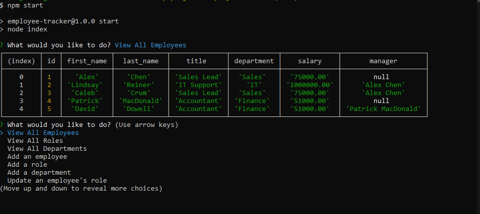

# Employee Tracker

## About the Project
This application was created to provide you with a way to keep track of all of your employees, departments, and roles within your company by creating tables of data using MySQL. There are three main tables of information that are generated when starting the application. The employee table stores the id number of each employee, their first name, their last name, the id number of their role, and the id number of their manager. The role table stores the id number of the role, the title of the role, the salary, and the id number of the department the role belongs to. The department table stores the id number of the department and the name of the department. When you start the application you will be prompted with many options. You can view all employees, view all roles, view all departments, add an employee, add a role, add a department, update an employee's role, update an employee's manager, and exit out of the application for when you are done using it and all of the information will be saved and available for the next time you use it.

## Built With:

## Installation Requirements
This application is dependant on Node.js, Inquirer.js, and MySQL. Make sure to also add a .env file to hold your MySQL username and password so that private information is kept secure.

## Walkthrough Video
https://drive.google.com/file/d/1AK18xs1A4Yd1CgMcTgBxltXCbY7eyC2x/view

## Here's a preview of what the application looks like!

## Contribution:
Made by Mitchell Armstrong

## Contact
Mitchell Armstrong - mra0211@gmail.com
